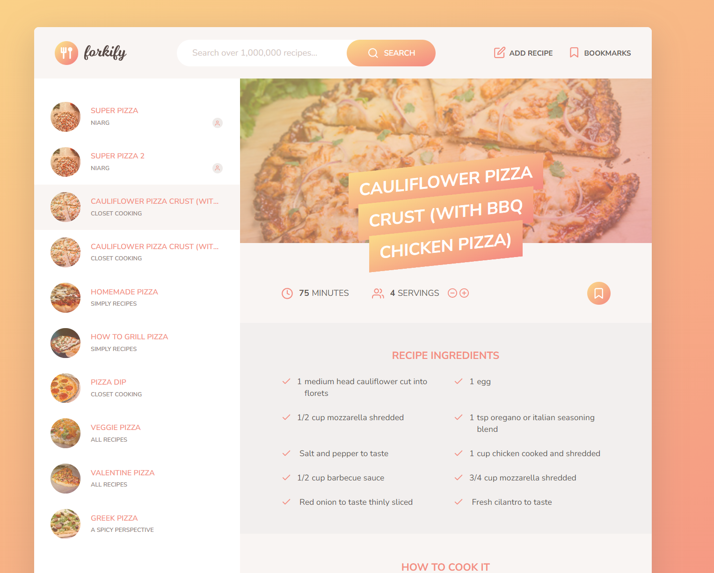

# Forkify Project

A recipe resource for home cooks. Browse from existing recipes or add your own!

<div align="center">
  <a href="https://forkify-tengzin.netlify.app//">
    
  </a>
  <h1 align="center">Forkify</h1>

  <p align="center">
    <a href="https://forkify-tengzin.netlify.app//">Demo</a>
  </p>
</div>

## Preview



## Features

- Search for pre-existing recipes
- Bookmark recipes that you want to see again
- Upload your own recipes
- Adjust number of servings, ingredients update automatically

## Flowchart


## Architecture


## Running locally

1. Clone the repo

```
git clone https://github.com/Tengzin/Forkify.git
```

2. Install dependencies

```
npm install
```

3. Start locally

```
npm start
```
